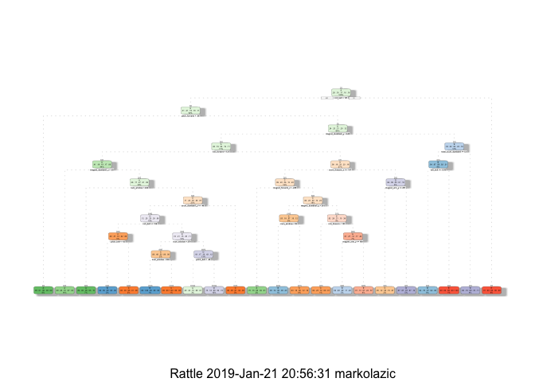

1. Overview

The goal of the project is to use machine learning algorithms on data from accelerometers on the belt, forearm, arm, and dumbell of 6 participants to predict the manner in which they performed the excercises.

2. Background

Using devices such as Jawbone Up, Nike FuelBand, and Fitbit it is now possible to collect a large amount of data about personal activity relatively inexpensively. These type of devices are part of the quantified self movement – a group of enthusiasts who take measurements about themselves regularly to improve their health, to find patterns in their behavior, or because they are tech geeks. One thing that people regularly do is quantify how much of a particular activity they do, but they rarely quantify how well they do it. In this project, your goal will be to use data from accelerometers on the belt, forearm, arm, and dumbell of 6 participants. They were asked to perform barbell lifts correctly and incorrectly in 5 different ways. More information is available from the website here: http://web.archive.org/web/20161224072740/http:/groupware.les.inf.puc-rio.br/har (see the section on the Weight Lifting Exercise Dataset).

Load the libraries

```r
library(caret)
```

```
## Loading required package: lattice
```

```
## Loading required package: ggplot2
```

```r
library(rpart)
library(rattle)
```

```
## Rattle: A free graphical interface for data science with R.
## Version 5.2.0 Copyright (c) 2006-2018 Togaware Pty Ltd.
## Geben Sie 'rattle()' ein, um Ihre Daten mischen.
```
Downloading and importing the data sets (train and test (quiz) data)

```r
train <- read.csv("https://d396qusza40orc.cloudfront.net/predmachlearn/pml-training.csv", header = T)
test <- read.csv("https://d396qusza40orc.cloudfront.net/predmachlearn/pml-testing.csv", header = T)
```
Cleaning the Data

a) Removing variables with near zero variance

```r
nzv <- nearZeroVar(train)
train_noNA <- train[,-nzv] 
test_noNA <- test[,-nzv]
```
b) Removing variables with NAs

```r
nas <- colMeans(is.na(train_noNA)) == 0
train_noNA <- train_noNA[,nas]
test_noNA <- test_noNA[,nas]
```
c) Removing first five columns with user names and times which are of little importance

```r
train_noNA <- train_noNA[6:59]
test_noNA <- test_noNA[6:59]
```
d) Creating training (60 %) and testing set (40 %)

```r
inTrain <- createDataPartition(train_noNA$classe, p = 0.6, list = FALSE)
training <- train_noNA[inTrain,]
testing <- train_noNA[-inTrain,]
```
1. Random Forests Model


```r
set.seed(123)
control_rf <- trainControl(method = "cv", number = 3, verboseIter = FALSE)
mod_rf <- train(classe ~ ., method = "rf", data = training, trControl = control_rf)
mod_rf$finalModel
pred_rf <- predict(mod_rf, newdata = testing)
conf_mat_rf <- confusionMatrix(pred_rf, testing$classe)
conf_mat_rf
# Accuracy : 0.9962 
```
2. Generalized Boosted Model

```r
mod_gbm <- train(classe ~ ., method = "gbm", data = training)
mod_gbm$finalModel
pred_gbm <- predict(mod_gbm, newdata = testing)
conf_mat_gbm <- confusionMatrix(pred_gbm, testing$classe)
conf_mat_gbm
# Accuracy : 0.9866
```
3. Linear Discriminant Analysis

```r
mod_lda <- train(classe ~ ., method = "lda", data = training)
mod_lda$finalModel
pred_lda <- predict(mod_lda, newdata = testing)
conf_mat_lda <- confusionMatrix(pred_lda, testing$classe)
conf_mat_lda
# Accuracy : 0.7164
```
4. Decission Tree

```r
mod_tree <- rpart(classe ~ ., data = training, method="class")
fancyRpartPlot(mod_tree)
```

<!-- -->

```r
predict_tree <- predict(mod_tree, newdata = testing, type = "class")
conf_mat_tree <- confusionMatrix(predict_tree, testing$classe)
conf_mat_tree
# Accuracy : 0.7698
```

Four different models gave the following results:
1. Random Forest Model: 0.9962
2. Generalized Boosted Model: 0.9866
3. Linear Discriminant Analysis 0.7164
4. Decission Tree: 0.7698

The Random Forest model was the most accurate one with 0.99 % accuracy. Therefore, we will use the RF model to predict the 20 quiz questions from the test file.

Prediction


```r
predict_quiz <- predict(mod_rf, newdata = test_noNA)
predict_quiz
```

```
##  [1] B A B A A E D B A A B C B A E E A B B B
## Levels: A B C D E
```

```r
# B A B A A E D B A A B C B A E E A B B B
```

